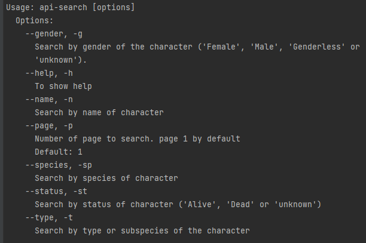

### CLI implementado con programación funcional para consultar Rick and Morty

#### Tecnología usada
- Java 1.8
- Gradle 7.0.2
- JCommader 1.82
- Feign-core 12
- Feign-gson 12
- Lombok 1.18.24
- JUnit 5.9.0

#### Objetivo
Usar programación funcional para implementar un CLI que permite consultar el API Rick And Morty
- Nota, se usó de base el código implementado por el docente Sinuhé Jaime Valencia de Platzi en el [Curso de programación Funcional con Java SE](https://platzi.com/cursos/java-funcional/)
- Se adicionaron algunos test unitarios

#### Documentación Rick And Morty
- [The Rick And Morty API](https://rickandmortyapi.com/)

#### Cómo correr el CLI
- por línea de comando valida las opciones del CLI
  - ./gradlew run --args='-h' y debe retornar el menú así: 

#### Test Unitarios
- Pendiente adicionar los test unitarios